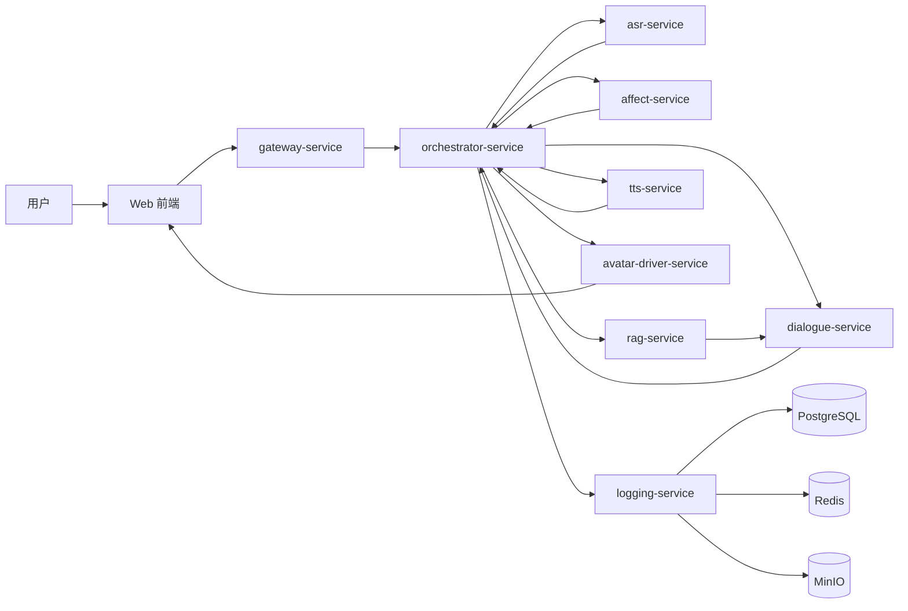

# 情感陪护虚拟数字人系统整体技术路线

## 1. 文档目标

本文档给出整套系统的总设计，用于统一后续 9 个模块文档的边界、接口和实施顺序。目标不是追求最强单模型，而是在比赛周期内稳定交付一个可执行、可评测、可录制 Demo 的闭环系统。

## 2. 赛题约束映射

根据赛题要求，系统必须覆盖以下能力：

- 至少 2 个数字人形象，且具备差异化表达能力。
- 支持文本和语音两种交互方式。
- 接入摄像头和麦克风，采集视频与音频。
- 具备独立可执行的 ASR 工程。
- 基于 LLM 与心理知识库进行多轮对话与干预。
- 实现文本、语音、视频三模态分析与融合。
- 具备独立可执行的面部行为驱动工程。
- 能以 Docker 或安装包形式完整交付。
- 满足 `WER <= 10%`、`SER <= 40%`、连续对话 `>= 10` 轮、上下文窗口 `>= 8k`、单样本响应 `<= 60s`。

## 3. 总体目标

系统最终要形成一个闭环：

`用户输入 -> 多模态感知 -> 心理状态理解 -> 检索知识 -> LLM 生成干预 -> TTS 合成 -> 数字人表达 -> 再评估`

核心策略是“三层架构 + 两条主线”：

- 三层架构：实时交互层、智能编排层、模型服务层。
- 两条主线：演示主线优先跑通，得分主线持续补齐赛题要求。

## 4. 总体架构



## 5. 模块拆分与文档对应关系

| 文档 | 模块 | 主要职责 |
| --- | --- | --- |
| `00-overview.md` | 总览 | 架构、路线、里程碑、交付标准 |
| `01-frontend.md` | 前端交互层 | 采集、展示、字幕、数字人舞台、会话控制 |
| `02-gateway-orchestrator.md` | 网关与编排 | WebSocket、会话管理、任务调度、状态流转 |
| `03-asr.md` | 语音识别 | 流式识别、热词、断句、评测 |
| `04-multimodal-affect.md` | 多模态感知 | 文本/音频/视频情绪与风险融合 |
| `05-dialogue-state-llm.md` | 对话与状态机 | 多轮记忆、状态机、LLM JSON 输出 |
| `06-rag-kb.md` | 心理知识库 | 知识切分、向量检索、干预模板 |
| `07-tts-avatar.md` | TTS 与数字人 | 双声线、口型、表情、动作驱动 |
| `08-data-ops-eval.md` | 数据与评测 | 日志、评测、压测、可解释性 |
| `09-deploy-deliverables.md` | 部署与交付 | Docker、目录规范、交付包、答辩准备 |

## 6. 推荐技术栈

- 前端：`Next.js + React + Tailwind CSS + Zustand + WebSocket/WebRTC`
- 后端：`FastAPI + Celery + Redis + PostgreSQL + MinIO`
- LLM 服务：`vLLM + Qwen2.5-7B/14B-Instruct`
- ASR：`FunASR Paraformer + FSMN-VAD + CT-Punc`
- 多模态分析：文本分类器 + `emotion2vec` + `MediaPipe` + 轻量融合器
- RAG：`bge-m3 + pgvector + bge-reranker`
- TTS：`CosyVoice2` 或同级本地中文 TTS
- 数字人：2D 分层角色基线，统一驱动协议，保留 3D 升级接口

## 7. 端到端主流程

1. 前端采集用户音频、视频帧和文本输入。
2. 网关创建会话并通过 WebSocket 推送实时状态。
3. ASR 服务输出流式转写。
4. 多模态服务对文本、音频、视频按 5 秒窗口打分。
5. 编排服务汇总状态、判断风险、决定对话阶段。
6. RAG 服务检索对应的心理支持知识。
7. LLM 生成结构化回复和下一步动作。
8. TTS 将回复转为音频，数字人驱动服务生成口型和表情参数。
9. 前端渲染数字人、字幕、风险卡片，并记录日志。
10. 系统根据新一轮用户输入进入再评估。

## 8. 研发阶段规划

### 阶段 1：最小闭环

- 跑通 `语音/文本输入 -> ASR -> LLM -> TTS -> 数字人播放`
- 目标：3 天内可录第一版 Demo

### 阶段 2：状态机与安全

- 引入 `engage / assess / intervene / reassess / handoff`
- 引入高风险规则与结构化 JSON 输出

### 阶段 3：多模态贴题

- 接入摄像头、音频特征、文本分类
- 实现三模态融合与冲突追问

### 阶段 4：交付化

- 完成双数字人、Docker、评测、日志导出、模型工程文件整理

## 9. 推荐仓库结构

```text
project/
  apps/
    web/
    api-gateway/
    orchestrator/
  services/
    asr-service/
    affect-service/
    rag-service/
    dialogue-service/
    tts-service/
    avatar-driver-service/
    logging-service/
  libs/
    shared-schema/
    prompt-templates/
    eval-tools/
  data/
    kb/
    demo_sessions/
  infra/
    compose/
    docker/
    nginx/
  docs/
```

## 10. 核心验收标准

- Demo 模式和真实模式都可运行。
- 连续 10 轮对话不丢上下文，不破坏状态机。
- 三模态结果可视化，且能展示冲突追问逻辑。
- 两个数字人具备不同声线、动作和提示风格。
- 能输出实验表：ASR 指标、时延、稳定性、异常恢复。
- 交付包中包含前后端系统、ASR 工程、数字人驱动工程、Docker 配置和 README。

## 11. 实施原则

- 先跑通主链路，再替换局部模型。
- 所有服务先定义输入输出 JSON，再写实现。
- 每个模块都支持 `demo mode`，保证随时能联调和录屏。
- 每天固定做一次全链路集成，避免最后阶段爆炸式返工。

## 12. 企业验证集接入原则

当前仓库中的 `data/val` 已经具备可复用的多模态验证集价值，后续技术路线必须显式纳入这套数据契约。

- 原始验证集只读，统一通过 [data_spec.md](./data_spec.md) 和 `data/manifests/val_manifest.jsonl` 接入。
- 角色、标签和片段对齐统一使用 `canonical_role`、`record_id` 和 `segment_id`，不要在各服务中重复发明映射规则。
- NoXI 和 RECOLA 可用于多模态对齐、离线回放、数字人驱动离线验证和 ASR 基线验证，但不能直接充当心理知识库来源。
- 所有评测、答辩表格和日志回放都应能追溯到 manifest 中的样本记录。
- 当前自动扫描结果可作为第一版数据基线：`1126` 条记录，其中 NoXI `1106` 条、RECOLA `20` 条，完整音频+视频+情绪+3D 样本 `1124` 条。
