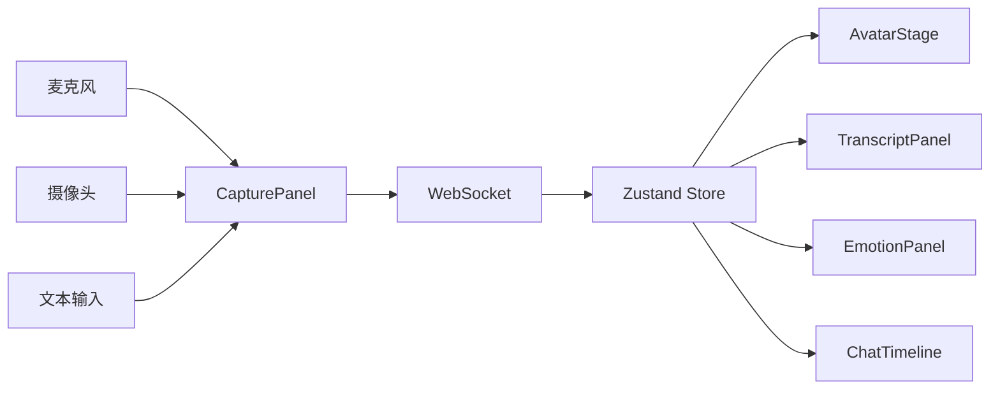

# 前端交互层实施方案

## 1. 在整体技术路线中的位置

前端交互层负责“采集、展示、控制”三件事，是演示主线最先被看到的部分。它不承载复杂推理，但必须稳定地把用户输入送入后端，并把后端状态实时反映到页面上。

## 2. 模块目标

- 接入摄像头、麦克风和文本输入。
- 展示两个数字人中的任意一个。
- 实时显示 ASR 字幕、系统回复、情绪与风险状态。
- 支持会话开始、暂停、恢复、导出日志。
- 支持 `demo mode` 与 `live mode`。

## 3. 技术选型

- 框架：`Next.js + React`
- 样式：`Tailwind CSS`
- 状态管理：`Zustand`
- 实时通信：`WebSocket`
- 媒体采集：`MediaDevices.getUserMedia`
- 本地缓存：`IndexedDB` 或 `localStorage`

## 4. 页面与组件划分

建议采用单页控制台布局，核心组件如下：

- `CapturePanel`：摄像头预览、麦克风状态、文本输入框
- `AvatarStage`：数字人渲染区、字幕叠层、播放状态
- `TranscriptPanel`：流式转写与系统回复
- `EmotionPanel`：三模态状态、融合结论、风险等级
- `ChatTimeline`：多轮会话历史
- `SessionControl`：开始、暂停、重置、导出

## 5. 前端数据流



## 6. 会话状态设计

前端会话状态建议统一为：

```ts
type SessionStatus =
  | "idle"
  | "capturing"
  | "recognizing"
  | "reasoning"
  | "speaking"
  | "paused"
  | "error";
```

页面只根据状态机渲染，不要在组件中散落 if/else。这样后续接入流式 LLM、流式 TTS 时不会混乱。

## 7. WebSocket 事件协议

建议统一事件格式：

```json
{
  "event": "transcript.partial",
  "session_id": "sess_001",
  "timestamp": 1710000000,
  "payload": {}
}
```

前端至少订阅以下事件：

- `session.created`
- `audio.chunk.ack`
- `transcript.partial`
- `transcript.final`
- `affect.updated`
- `dialogue.reply`
- `tts.ready`
- `avatar.command`
- `session.error`

## 8. 实现步骤

### 第 1 步：页面骨架

- 完成单页布局与组件占位
- 接入 Zustand Store
- 接入 `demo mode` 假数据

### 第 2 步：媒体采集

- 接入摄像头和麦克风权限请求
- 音频按 320ms 或 640ms 分块发送
- 视频按 1fps 到 2fps 采样上传，不传完整视频流

### 第 3 步：实时展示

- 显示流式字幕和回复
- 显示情绪、风险、当前阶段
- 播放数字人音频与动作

### 第 4 步：导出与回放

- 导出本次会话 JSON 日志
- 支持载入历史会话做复盘展示

## 9. 关键交互细节

- 麦克风掉线时自动回退到文本输入模式。
- 摄像头拒绝授权时，系统仍可进入文本/语音模式，但明确提示“视频模态未启用”。
- 数字人未准备完成时，先显示字幕和等待动画，避免界面卡死。
- 风险升高时，页面固定展示显著的风险卡片，不允许完全被聊天流淹没。

## 10. 前端接口清单

- `POST /api/session/create`
- `POST /api/session/:id/text`
- `WS /ws/session/:id`
- `GET /api/session/:id/export`
- `GET /api/avatar/catalog`

## 11. 风险与规避

- 浏览器兼容性：优先支持 Chrome/Edge，比赛机器上统一环境。
- 音频同步问题：所有时间轴以服务端回传时间戳为准。
- 页面卡顿：视频只做抽帧上传，不在浏览器端做重模型推理。

## 12. 验收标准

- 10 分钟连续使用不出现页面冻结。
- 摄像头/麦克风权限申请、断开、恢复流程清晰可复现。
- WebSocket 断线后可在 3 秒内重连并恢复会话。
- 在 `demo mode` 下，无后端模型也能完整演示主链路。

## 13. 验证集回放模式要求

前端除了实时采集模式，还应支持基于 manifest 的离线回放模式，方便联调、录屏和评测复现。

- 页面应允许选择 `record_id` 或样本来源信息进行回放。
- 回放时显式展示 `dataset`、`session_id`、`canonical_role`、`segment_id`。
- 当样本缺失某个模态时，面板必须显示“缺失”而不是假装有结果。
- 浏览器端不直接扫描 `data/val`，只消费后端基于 manifest 暴露的样本元数据和媒体地址。
