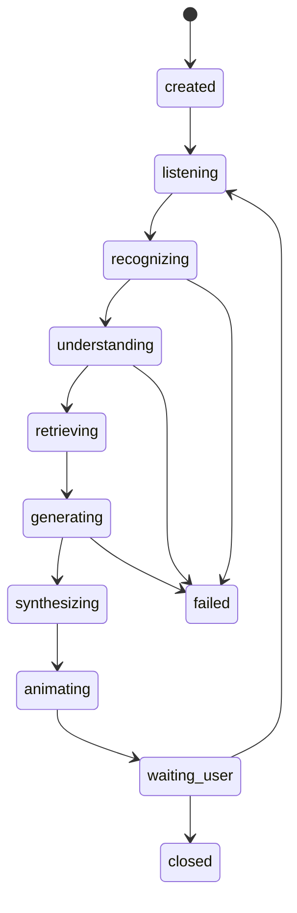

# 网关与编排层实施方案

## 1. 在整体技术路线中的位置

网关与编排层是系统的大脑，负责把前端的实时输入变成一条可追踪、可恢复、可扩展的处理流水线。所有模型服务都应通过这一层被调度，而不是直接互相调用。

## 2. 模块职责

### gateway-service

- 统一 HTTP / WebSocket 入口
- 会话创建、鉴权、限流、心跳
- 输入标准化
- 输出事件分发

### orchestrator-service

- 主流程状态机
- 调用 ASR、感知、RAG、LLM、TTS、数字人驱动
- 维护多轮上下文和任务生命周期
- 处理失败重试、超时和降级

## 3. 服务边界

网关负责“收”和“发”，编排负责“判断”和“调度”。不要把业务逻辑塞进网关，否则后期会失控。

## 4. 通信方式

- 网关与前端：`WebSocket + HTTP`
- 网关与编排：同步 HTTP 或 Redis 事件
- 编排与重任务服务：`Celery + Redis`
- 状态通知：`Redis Pub/Sub` 或 `Redis Streams`

推荐组合：

- 实时小事件走 `Redis Streams`
- 重任务和重试走 `Celery`

## 5. 会话状态机



## 6. 统一事件模型

所有内部事件都采用同一结构：

```json
{
  "trace_id": "trace_xxx",
  "session_id": "sess_xxx",
  "stage": "recognizing",
  "source": "asr-service",
  "payload": {},
  "created_at": "2026-03-06T12:00:00Z"
}
```

这样做有两个好处：

- 日志系统可以直接按 `trace_id` 串联全链路。
- 出问题时可以回放事件，不必猜测模块内部发生了什么。

## 7. 核心接口设计

### 对前端

- `POST /session/create`
- `POST /session/{id}/text`
- `POST /session/{id}/audio`
- `POST /session/{id}/frame`
- `GET /session/{id}/state`
- `WS /session/{id}/events`

### 对内部服务

- `POST /internal/asr/submit`
- `POST /internal/affect/analyze`
- `POST /internal/rag/retrieve`
- `POST /internal/dialogue/respond`
- `POST /internal/tts/synthesize`
- `POST /internal/avatar/drive`

## 8. 任务编排建议

### 同步阶段

- 会话创建
- 文本输入
- WebSocket 事件推送

### 异步阶段

- ASR 推理
- 视频和音频情绪分析
- RAG 检索
- LLM 调用
- TTS 合成
- 数字人驱动参数生成

### 并发策略

- ASR 与视频/音频分析并行
- RAG 与风险规则并行
- TTS 在回复文本稳定后立即启动
- 数字人驱动在 TTS 音频生成后立即执行

## 9. 失败恢复与降级

- ASR 超时：允许用户改用文本输入
- 视频模态失败：保留文本+音频模式
- RAG 无命中：回退到安全基础模板
- TTS 失败：只显示字幕与文字回复
- 数字人驱动失败：播放音频并显示静态数字人

## 10. 会话上下文管理

- Redis：短期上下文、最新阶段、任务状态
- PostgreSQL：完整对话记录、评估结果、可追溯日志
- MinIO：音频片段、视频帧、导出报告

建议的 Redis Key：

- `session:{id}:state`
- `session:{id}:history`
- `session:{id}:latest_affect`
- `task:{trace_id}:status`

## 11. 实施顺序

1. 先完成网关创建会话与 WebSocket 推送。
2. 接入 orchestrator 的 mock 流程。
3. 替换为真实 ASR 和 LLM。
4. 再把多模态、RAG、TTS、数字人驱动接入同一编排框架。
5. 最后补齐重试、超时和导出逻辑。

## 12. 验收标准

- 单会话 10 轮交互无状态错乱。
- 所有关键步骤都能在日志中按 `trace_id` 查到。
- 任意子服务挂掉后，系统可降级而不整体崩溃。
- 前端能收到完整的阶段变化事件并正确渲染。
