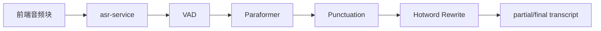

# ASR 模块实施方案

## 1. 在整体技术路线中的位置

ASR 是所有语音交互的入口模块，直接影响转写质量、响应时延和后续 LLM 理解准确率。比赛要求给出独立可执行的语音识别工程，因此该模块必须单独服务化，并附带评测脚本。

## 2. 模块目标

- 支持中文普通话实时识别。
- 支持流式返回局部结果和最终结果。
- 支持热词、标点恢复和静音检测。
- 达成目标：`WER <= 10%`、`SER <= 40%`。
- 以独立工程形式交付：`train / infer / export / evaluate`。

## 3. 推荐方案

优先采用本地中文 ASR 组合：

- 声学模型：`FunASR Paraformer-Large` 或流式变体
- VAD：`FSMN-VAD`
- 标点恢复：`CT-Transformer Punc`
- 热词注入：心理健康领域词表

选择理由：

- 中文效果稳定，适合本地部署
- 流式工程成熟，比赛可控
- 容易封装成独立服务和评测脚本

## 4. 服务架构



## 5. 输入输出协议

### 流式输入

- 音频格式：`16kHz`, `mono`, `wav/pcm`
- 分块大小：320ms 或 640ms
- 每个 chunk 带 `session_id`、`chunk_id`、`timestamp`

### 输出

```json
{
  "session_id": "sess_001",
  "is_final": false,
  "text": "我最近有点",
  "start_ms": 0,
  "end_ms": 1280,
  "confidence": 0.92
}
```

## 6. 领域增强方案

### 热词表

建立 `hotwords.txt`，至少包含：

- 焦虑、抑郁、双相、失眠、躯体化
- 呼吸训练、情绪记录、睡眠卫生
- 学校、室友、考试、就业、家人

### 文本后处理

- 同音纠错
- 口语词规范化
- 数字、时间表达统一
- 明显噪声片段删除

## 7. 评测方案

### 数据集构成

- 自采比赛场景录音：安静环境、普通宿舍环境、轻度噪声环境
- 说话人多样化：男声、女声、普通话略带口音
- 场景类型：求助、日常倾诉、情绪描述、短问答

### 指标计算

- `WER`：逐句转写误差
- `SER`：句级错误率
- `RTF`：实时率
- `P95 latency`：95 分位延时

### 评测脚本

工程中必须包含：

- `infer_stream.py`
- `infer_batch.py`
- `eval_wer.py`
- `hotwords.txt`
- `README.md`

## 8. 时延优化

- 开启流式识别，不等待整句结束。
- VAD 用于截断长静音，减少无效推理。
- 标点恢复放在 final transcript 阶段，避免拖慢 partial。
- 对热词替换做词典规则，不走大模型。

## 9. 与其他模块的接口关系

- 向前端输出 `transcript.partial`、`transcript.final`
- 向多模态模块提供标准化文本输入
- 向日志模块提供置信度与时间戳

## 10. 降级策略

- 本地模型异常时，可切换到备用云 ASR 作为演示保底。
- 流式失败时，自动降级为整句识别模式。
- 麦克风异常时，允许纯文本交互继续进行。

## 11. 实施步骤

1. 先跑通离线批量识别。
2. 再接入流式识别与 partial transcript。
3. 加入 VAD、标点、热词。
4. 接入 WebSocket 回传与全链路日志。
5. 最后做评测、压测和 Docker 封装。

## 12. 验收标准

- 安静环境下达到赛题指标。
- 5 分钟连续语音输入不崩溃。
- 能在页面上稳定显示 partial 和 final 转写。
- 独立 ASR 工程可单独启动、单独评测、单独导出结果。

## 13. 企业验证集接入要求

当前企业验证集可直接用于 ASR 的离线基线验证，但必须经过统一预处理。

- 原始企业音频为 `44.1kHz` 双声道，进入识别前必须转成 `16kHz` 单声道。
- ASR 评测输入统一从 manifest 的 `audio_path_16k_mono` 读取，而不是直接读取原始音频。
- ASR 批处理只允许写入转录模板中的初稿字段，例如 `draft_text_raw`、`draft_segments`、`draft_confidence_mean`、`asr_engine`，不得直接覆盖 `final_text`。
- 转录状态应按 `pending_asr -> draft_ready -> pending_review -> verified` 推进；人工复核完成前，不得把样本计入正式评测集。
- 参考文本必须写回统一转录工作流文件，并通过 `text_status` 区分 `asr_generated` 与 `human_verified`。
- 最终 WER/SER 报告只允许使用 `human_verified` 参考文本，不允许模型生成结果自评。
- 人工复核推进必须通过统一脚本执行，至少覆盖：
  - `queue-report`
  - `start-review`
  - `complete-review`
- 当前已生成 `data/derived/transcripts/val_transcripts_template.jsonl`，共 `1126` 条转录工作流记录；实时状态以 `data/derived/qc_report.md` 为准，后续 ASR 流程应直接回填这一文件链路。

## 14. 当前落地状态

步骤 18 的离线基线服务已经落到独立目录：

- `services/asr-service/main.py`
- `services/asr-service/README.md`

当前边界：

- 只支持上传一个完整音频文件并返回整句结果
- 输入优先使用企业 manifest 中的 `audio_path_16k_mono`
- 当前 live 校验脚本为 `scripts/verify_asr_service.py`
- 当前批量写回入口为 `scripts/write_asr_drafts.py transcribe-service`
- 当前人工复核入口为 `scripts/manage_transcript_review.py`
- 当前 `qwen3-asr-flash` 主路径已切到 DashScope 原生同步接口，接口地址为 `https://dashscope.aliyuncs.com/api/v1/services/aigc/multimodal-generation/generation`
- 服务内部保留 DashScope OpenAI-compatible 路径作为回退，不再把兼容路径当作主配置
- 当前提供方仍不暴露 token 级置信度，因此服务响应保留 `confidence_mean=null` 和 `confidence_available=false`
- 步骤 21 已在 `services/asr-service/main.py` 内加入确定性后处理：长静音切分、基础标点恢复、`services/asr-service/hotwords.json` 热词归一
- 步骤 21 的验证脚本为 `scripts/verify_asr_postprocess.py`，可直接对比增强前后的同一段音频文本
