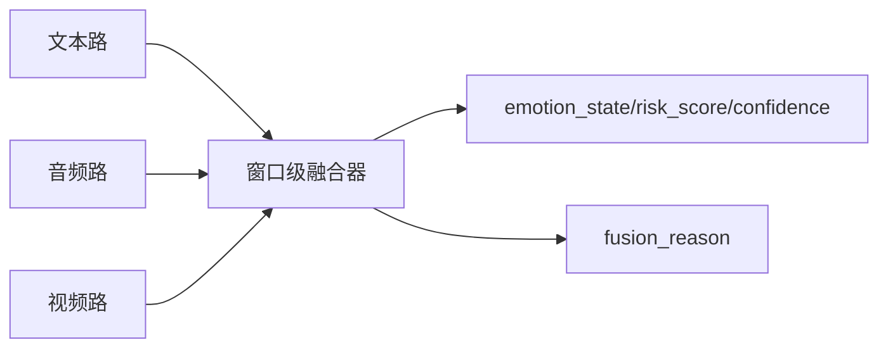

# 多模态感知与融合实施方案

## 1. 在整体技术路线中的位置

多模态感知模块决定系统是否真正贴合赛题，而不是退化成“普通聊天机器人”。它负责从文本、音频、视频三条路径提取线索，并输出统一的情绪状态、风险等级和置信度。

## 2. 模块目标

- 分析文本、音频、视频三模态特征。
- 在 5 秒滑动窗口内完成时序对齐与融合。
- 解决模态冲突并触发澄清追问。
- 输出可解释的中间结果，便于答辩展示。

## 3. 总体设计



## 4. 文本路设计

### 输入

- ASR 最终文本
- 用户直接输入文本
- 最近 3 轮上下文摘要

### 输出

- `emotion_label`
- `risk_score_text`
- `keywords`
- `semantic_summary`

### 推荐实现

- 小模型分类：中文 `RoBERTa` 或 `MacBERT` 微调情绪与风险分类
- 规则增强：自伤、绝望、持续失眠、明显躁狂线索词

文本路负责语义，但不能独占最终判断。

## 5. 音频路设计

### 输入

- 用户原始音频或 VAD 截断后的片段

### 特征

- 音量均值与波动
- 语速
- 停顿长度
- 基频与抖动
- 高频能量与低能量比例

### 推荐实现

- 特征提取：`librosa` + `openSMILE`
- 表征模型：`emotion2vec` 或同级轻量音频情感模型

### 输出

- `audio_emotion`
- `audio_risk_score`
- `speech_energy`
- `prosody_summary`

## 6. 视频路设计

### 输入

- 摄像头抽帧，建议 1fps 到 2fps

### 特征

- 面部表情概率
- 头部姿态变化
- 目光回避程度
- 眨眼频率
- 嘴部活动度与疲惫代理特征

### 推荐实现

- 检测与关键点：`MediaPipe Face Landmarker`
- 表情分类：轻量 CNN/MLP，对关键点或裁剪脸图推理

### 输出

- `facial_emotion`
- `visual_withdrawal_score`
- `face_confidence`

## 7. 融合策略

### 时间对齐

- 以 5 秒为基础窗口
- 每个窗口生成一个统一 feature vector
- 对齐维度：文本时间戳、音频时间戳、视频帧时间戳

### 融合器

V1 先用可解释、训练成本低的方案：

- `MLP` 或 `XGBoost`
- 输出 `emotion_state`、`risk_score`、`confidence`

V2 再升级为轻量 Transformer，用于更细的时序建模。

## 8. 模态冲突处理

典型冲突：

- 文本说“我没事”，音频能量低，视频表现回避
- 文本表达积极，但面部持续低落

处理方式：

1. 为每个模态输出单独置信度。
2. 当模态差异超过阈值时，标记 `conflict=true`。
3. 返回 `fusion_reason`。
4. 交给对话模块触发澄清问题。

示例输出：

```json
{
  "emotion_state": "possible_depressive_tendency",
  "risk_score": 0.68,
  "confidence": 0.74,
  "conflict": true,
  "fusion_reason": "text-neutral but audio-low-energy and facial-sadness-high"
}
```

## 9. 接口设计

`POST /analyze/window`

输入：

- `session_id`
- `text_segment`
- `audio_uri`
- `frame_uris`
- `window_start`
- `window_end`

输出：

- `text_result`
- `audio_result`
- `video_result`
- `fusion_result`

当前仓库中的 step-37 基线先提供一个更轻的统一服务边界：

- `POST /internal/affect/analyze`
- 直接输出 `text_result / audio_result / video_result / fusion_result`
- 同时返回 `source_context.origin / dataset / record_id / note`

这样前端可以先把结果稳定挂载到 Emotion Panel，而后续步骤 38-41 只需要逐步替换内部 lane 逻辑，不必再改展示层契约。

## 10. 训练与标注建议

- 优先使用公开情绪数据集训练基础分类器。
- 再用比赛 Demo 脚本自采少量数据做域适配。
- 标注粒度以“窗口”为单位，不追求逐帧标签。

## 11. 风险与规避

- 摄像头画质不稳定：视频路置信度低时自动降权。
- 用户不愿开摄像头：保留文本+音频融合路径。
- 小样本训练不足：V1 不强求端到端大模型，先靠规则+轻量融合器。

## 12. 验收标准

- 页面可展示三路结果和最终融合结论。
- 至少演示 2 个模态冲突场景并触发追问。
- 每个窗口能输出 `emotion_state`、`risk_score`、`confidence`。
- 融合结果进入对话模块后，能明显影响后续回复策略。

## 13. 企业验证集对齐规范

当前企业验证集已经提供音频、视频、情绪 CSV 和 3D 面部特征，因此多模态模块必须基于 manifest 做样本对齐。

- 训练和离线验证时，样本主键统一为 `dataset + session_id + canonical_role + segment_id`。
- NoXI 和 RECOLA 的原始角色命名不同，内部只消费 `canonical_role`。
- 当前抽查样本中，情绪 CSV 的有效数据行数与 3D 特征时间步存在 `750/751` 的轻微错位，因此预处理阶段必须显式做裁剪、补齐或时间归一化。
- `_full.npy` 默认只保留为备用输入，不进入 V1 训练主路径。
- 当前完整扫描结果显示：`1126` 条 manifest 记录中，`1124` 条具备完整 AV+Emotion+3D 资源，另有 `2` 条 RECOLA 记录缺少情绪标签，全部需要在融合前被显式标记。
