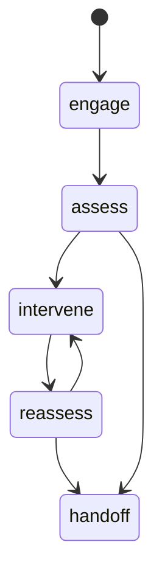

# 对话状态机与 LLM 实施方案

## 1. 在整体技术路线中的位置

LLM 负责系统的自然语言表达和策略执行，但必须被状态机、规则层和知识库约束。该模块的关键不是“聊得像人”，而是“在正确阶段做正确的干预，并始终可解释、可控”。

## 2. 模块目标

- 支持至少 10 轮连续对话。
- 上下文窗口不少于 8k。
- 按固定状态机推进会话。
- 统一输出结构化 JSON。
- 将高风险情况稳定导向安全回复和人工求助提示。

## 3. 模型推荐

- 当前基线：`qwen-plus`，通过 `DashScope OpenAI-compatible` 接口接入
- 本地化候选：`Qwen2.5-7B-Instruct` 或 `Qwen2.5-14B-Instruct`
- 部署方式：比赛阶段先 API，后续如需脱网演示再切 `vLLM`
- 原因：中文能力强、长上下文稳定、工程接入成本低

当前仓库在步骤 24 只做“真实 LLM 替换 mock”，因此不引入本地推理栈和复杂工具调用。

## 4. 状态机设计



### 阶段说明

- `engage`：建立联系，确认用户愿意继续交流
- `assess`：收集情绪、睡眠、压力源、持续时间等线索
- `intervene`：给出呼吸引导、认知重构、行为建议等非临床支持
- `reassess`：确认当前状态是否改善
- `handoff`：提示寻求辅导员、家人、校医院或专业帮助

当前仓库在步骤 25 将状态机强制落在网关持久化层，而不是只靠 prompt 约束。也就是说：

- LLM 可以“提议” `stage`
- 网关负责决定该 `stage` 是否允许落库
- 若出现跳阶段，会被收敛到最近合法阶段
- 若当前已进入 `handoff`，后续回复不能再回退到普通阶段

## 5. 非纯 LLM 架构

最终决策采用“三层协同”：

- 规则层：高风险词、极端表达、明显危险线索
- 分类层：多模态感知模块给出的风险评分
- LLM 层：负责语言组织、共情和追问

LLM 只负责“怎么说”，不独占“是否高风险”的判断权。

## 6. Prompt 结构

建议拆成 5 段：

- `system_prompt`：角色、边界、禁忌、不能做临床诊断
- `persona_prompt`：当前数字人风格
- `state_prompt`：当前阶段、目标、应避免的话术
- `knowledge_prompt`：RAG 返回的 2 到 3 条知识
- `memory_prompt`：最近几轮对话摘要和风险变化

## 7. 统一输出 JSON

```json
{
  "reply": "谢谢你愿意说出来，我们先慢一点。",
  "emotion": "anxious",
  "risk_level": "medium",
  "stage": "intervene",
  "next_action": "breathing",
  "knowledge_refs": ["breathing_478", "sleep_hygiene_basic"],
  "avatar_style": "warm_support",
  "requires_followup": true
}
```

要求：

- 回复文本必须可直接给 TTS 使用。
- 阶段字段必须严格属于状态机枚举。
- 输出失败时自动重试一次，仍失败则回退到规则模板。

## 8. 多轮记忆设计

- Redis 保存最近 6 到 10 轮完整上下文。
- PostgreSQL 保存整场会话和阶段切换记录。
- 每 3 轮生成一次摘要，防止上下文无限膨胀。

当前仓库在步骤 26 只实现第一层短期记忆：

- 记忆来源：`messages` 表最近几轮原始消息
- 注入位置：网关在调用对话服务前写入 `metadata.short_term_memory`
- 使用边界：只用于最近几轮事实回忆和上下文衔接，不做长期画像
- 当前验证：要求系统能在隔两轮后回忆出用户刚刚提供的姓名等事实

当前仓库在步骤 27 已加上第二层阶段性摘要：

- 触发条件：每累计 `3` 个用户回合生成一次摘要
- 生成边界：摘要请求仍然走 `apps/orchestrator -> services/dialogue-service`，不把 LLM 调用塞回网关
- 存储位置：`sessions.metadata.dialogue_summary`
- 结构要点：`summary_text`、`current_stage`、`user_turn_count`、`generated_at`、`generated_from_message_id`
- 复用方式：网关在后续调用对话服务时把该摘要作为 `metadata.dialogue_summary` 一并注入
- 事件留痕：每次摘要更新都会记录 `dialogue.summary.updated` 到 `system_events`
- 当前验证：连续 3 轮文本对话后必须能在 `/api/session/{session_id}/state` 和导出 JSON 中看到同一份摘要

摘要内容至少包括：

- 当前主要情绪
- 压力来源
- 已尝试的干预
- 风险等级变化
- 是否已建议线下求助

## 9. 安全策略

- 检测到高风险时，不允许输出轻率安慰或玩笑化表达。
- 明确禁止诊断式结论，如“你就是抑郁症”。
- 明确禁止提供危险行为指导。
- 在 `handoff` 阶段固定插入求助资源模板。

## 10. 工具调用建议

对话服务可调用以下工具：

- `retrieve_kb`
- `fetch_affect_summary`
- `trigger_reassess`
- `select_avatar_style`
- `escalate_handoff_template`

工具调用结果由编排层注入，不让模型直接访问数据库。

## 11. 实施顺序

1. 先用 mock 多轮历史验证 JSON 输出。
2. 接入真实 LLM，但保持 JSON 输出契约不变。
3. 接入状态机和规则层。
4. 接入 RAG 检索。
5. 接入风险升级逻辑和 handoff 模板。
6. 最后做长对话、超时和失败回退测试。

## 12. 验收标准

- 连续 10 轮对话阶段推进合理，无明显跳阶段。
- 高风险输入能稳定走向 `handoff`。
- 输出 JSON 字段完整、合法，可直接被后续模块消费。
- 不依赖人工修 prompt 即可完成标准 Demo 脚本。

## 13. 文本来源与离线评测边界

企业验证集当前不提供现成转录文本，因此对话模块在离线验证时必须明确文本来源。

- 任何离线对话样本都必须从 manifest 的 `transcript_path` 读取文本，不直接对原始音频做隐式转写。
- `text_status=human_verified` 的样本才可用于正式对话评测和提示词回归。
- 企业情绪标签只能作为情绪证据，不能直接推导 `risk_level` 或替代高风险规则层。
- 离线回放时应把 `record_id` 写入对话日志，便于复盘同一条样本在不同 prompt 版本下的差异。
